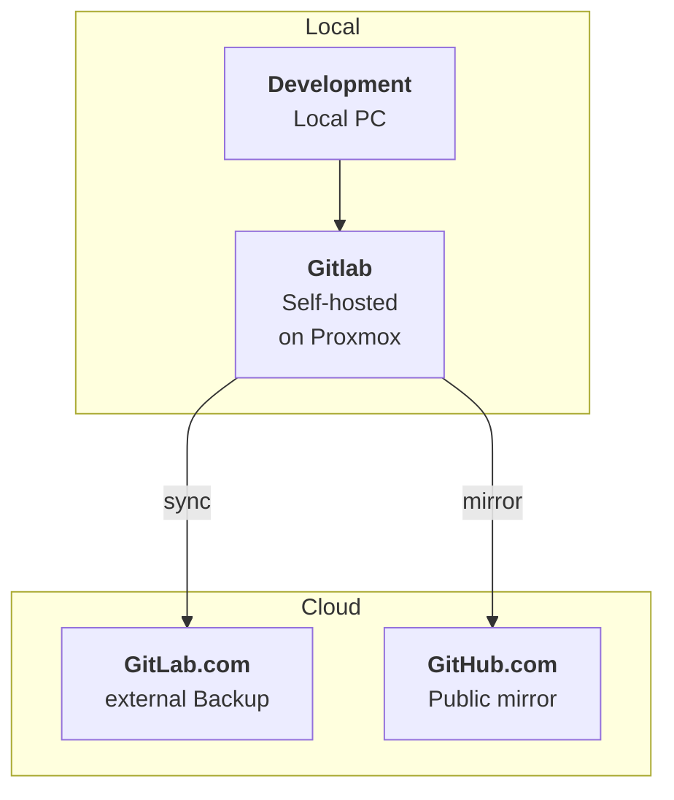
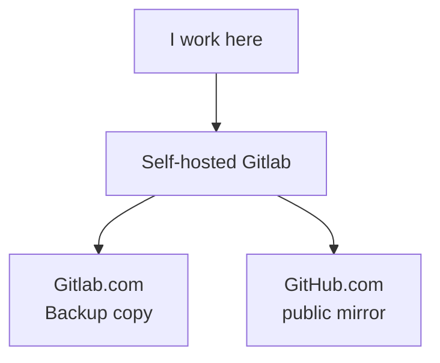

---
title: "Gitlab and Github backups with Proxmox and the cloud"
date: 2026-09-15
tags:
    - Git
    - GitLab
    - GitHub
    - Cybersecurity
    - Linux
description: "Git Repos are great, but Repos are no backups. Git backups are."
featured: true
---

# Why I Use GitLab on Proxmox, GitLab.com and GitHub Together

For my personal projects, I don't rely on a single Git hosting provider.

My current setup uses a self-hosted GitLab instance running on my Proxmox server as the primary development environment. The repositories are then synchronized with GitLab.com and mirrored to GitHub.

At first glance, this might seem unnecessarily complicated. It would certainly be simpler to just push everything directly to GitHub.

There are, however, a few practical reasons behind this setup.

## The setup

The basic workflow looks like this:

The self-hosted GitLab instance is where I actually work.

GitLab.com provides an external copy of my repositories, while GitHub serves as the public-facing mirror.

## Why self-host GitLab?

The main reason is simple: **speed and control**.

My GitLab instance runs on my own Proxmox server. Since the infrastructure is under my control, I can experiment with it, change configurations, add services and generally play around without worrying about breaking a hosted environment.

The local runners are also significantly faster for my use case than waiting for jobs to complete on GitLab.com.

This makes the self-hosted instance a convenient development environment rather than just another place to store Git repositories.

There is also a learning aspect to it.

Running GitLab myself means that I'm not only using Git. I'm also dealing with the infrastructure around it: virtualization, networking, authentication, backups, CI/CD runners and the general maintenance of a self-hosted service.

That is exactly the kind of infrastructure I want to understand better.

## Why keep a copy on GitLab.com?

Self-hosting introduces an obvious problem:

**What happens if my server goes down?**

My Proxmox server is useful, but it is still a single piece of infrastructure that I control.

Hardware can fail. A VM can become corrupted. I can make a configuration mistake. The entire server could become unavailable.

That's why I don't want the self-hosted GitLab instance to be the only copy of my repositories.

GitLab.com gives me an independent copy outside my own infrastructure.

So even if something happens to my Proxmox server, my repositories aren't sitting exclusively on a machine in my home lab.

Interestingly, GitLab.com is not actually my primary development environment anymore.

It is effectively my **off-site backup**.

## Why GitHub as well?

GitHub has a completely different purpose in this setup.

If you're looking at someone's technical portfolio, where do you look first?

For many developers and recruiters, the answer is GitHub.

I therefore want my projects to be available there without having to maintain another repository manually.

GitHub is consequently my **public mirror**.

The important part is that I don't want to remember to push to three different places every time I work on a project.

The synchronization should happen automatically.

My workflow therefore becomes:

I only need to work with my primary repository.

The rest is handled by the infrastructure.

## Why not just use GitHub?

I could.

And for many projects, that would probably be the sensible choice.

But that's not really the point of this setup.

I wanted to combine three things:

* **A fast local development environment**
* **An independent external copy**
* **A public repository that is easy for other developers and recruiters to find**

Using only GitHub would solve the third problem, but I would lose the advantages of my self-hosted environment.

Using only my own GitLab would give me control and speed, but leave me with a single location for my repositories.

Using GitLab.com alone would remove most of the infrastructure work, but I wouldn't get the same local development environment.

The three systems therefore have different jobs rather than simply being three redundant copies.

## The actual setup

Getting everything connected is surprisingly straightforward.

I started by changing the existing repository's `origin` URL so that my local Git repository pointed at my self-hosted GitLab instance.

From there, I created a copy of the repository on GitLab.com.

Finally, I configured the repository so that changes could be mirrored to GitHub automatically.

The individual steps are documented separately:

* [Changing the Git `origin` URL]
* [Creating a repository copy on GitLab.com]
* [Mirroring a repository to GitHub]

The goal is to keep each guide focused rather than turning this article into a giant list of commands.

## What I like about this setup

The biggest advantage is that each part has a clearly defined purpose.

**Self-hosted GitLab:**
Fast development environment and my primary repository.

**GitLab.com:**
External copy in case my own infrastructure becomes unavailable.

**GitHub:**
Public mirror for visibility and portfolio purposes.

And because the synchronization is automated, I don't have to think about maintaining all three repositories manually.

That's the part I particularly like.

The infrastructure should do the repetitive work for me.

## There is one slightly ugly part

There is one thing you might notice if you look at my Git configuration:

My GitLab URLs don't look quite like the usual ones.

That's intentional.

I use multiple SSH keys for different Git hosting environments, which requires some additional SSH configuration.

I'll cover that in a separate guide:

**Managing Multiple SSH Keys with `~/.ssh/config`**

That guide will explain why the SSH host names look unusual and how I configured Git to select the correct key automatically.

## Final thoughts

This setup isn't something I would recommend blindly to everyone.

If all you need is a place to put your code, using a single hosted Git provider is considerably simpler.

For me, however, the extra complexity is useful.

I get a fast self-hosted development environment, an external copy of my repositories, and an automatically maintained GitHub presence.

More importantly, the setup gives me an opportunity to work with infrastructure rather than simply consuming a hosted service.

And that's ultimately why I built it this way.

