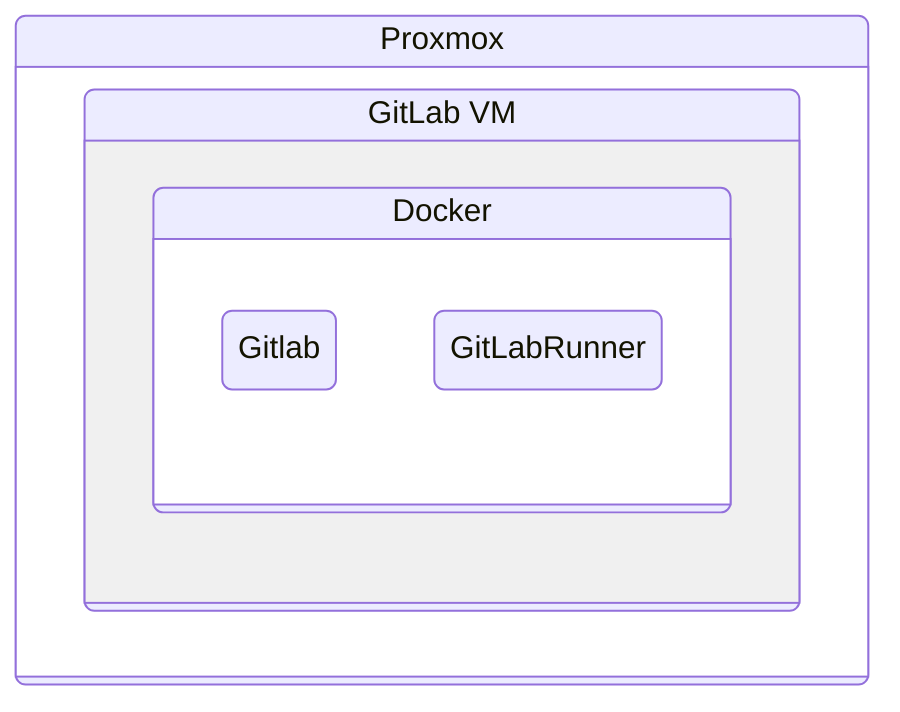

---

title: "Installing GitLab on a Proxmox VM with Docker"
date: 2026-08-22
draft: false
------------

This guide describes how to install GitLab Community Edition on a virtual machine running on Proxmox, using Docker Compose. A GitLab Runner is installed alongside GitLab and configured to execute CI/CD jobs using Docker.



## Prerequisites

The setup consists of:

* A virtual machine running on Proxmox
* Ubuntu or another Debian-based Linux distribution
* A static IP address for the VM
* Docker and Docker Compose
* GitLab Community Edition
* GitLab Runner

For this example, the GitLab VM has an address similar to:

```text
192.168.1.xxx
```

Replace this address with the actual IP address of your VM throughout the guide.

## Create the VM

Create a new VM in Proxmox and install a supported Linux distribution.

For a small home-lab installation, the exact VM resources depend on how many repositories, users, and CI jobs you expect to run. GitLab can be relatively resource-intensive, so avoid allocating too little RAM or disk space.

Once the VM is installed, log in via SSH or the Proxmox console.

## Install Docker

Update the system first:

```bash
sudo apt update
sudo apt upgrade
```

Install the packages required by GitLab and Docker:

```bash
sudo apt install -y ca-certificates curl openssh-server tzdata perl
```

### Optional: Install Postfix

If GitLab needs to send email directly from the server, Postfix can be installed:

```bash
sudo apt install -y postfix
```

For a basic home-lab installation, Postfix can also be omitted if email functionality is not required.

### Install Docker

Install Docker using Docker's installation script:

```bash
curl -fsSL https://get.docker.com | sudo bash
```

Add the current user to the `docker` group:

```bash
sudo usermod -aG docker $USER
```

Log out and log back in for the group membership to take effect.

Verify Docker is working:

```bash
docker version
```

## Create the GitLab Docker Compose configuration

Create directories for GitLab's persistent data:

```bash
sudo mkdir -p /srv/gitlab/config
sudo mkdir -p /srv/gitlab/logs
sudo mkdir -p /srv/gitlab/data
sudo mkdir -p /srv/gitlab-runner/config
```

Create a `compose.yaml` file:

```yaml
services:
  gitlab:
    image: gitlab/gitlab-ce:latest
    container_name: gitlab
    hostname: gitlab.local
    restart: always
    ports:
      - "80:80"
      - "443:443"
      - "2222:22"
    volumes:
      - /srv/gitlab/config:/etc/gitlab
      - /srv/gitlab/logs:/var/log/gitlab
      - /srv/gitlab/data:/var/opt/gitlab
    environment:
      GITLAB_OMNIBUS_CONFIG: |
        external_url 'http://192.168.1.xxx'
        gitlab_rails['gitlab_shell_ssh_port'] = 2222

  gitlab-runner:
    image: gitlab/gitlab-runner:latest
    container_name: gitlab-runner
    restart: always
    depends_on:
      - gitlab
    volumes:
      - /srv/gitlab-runner/config:/etc/gitlab-runner
      - /var/run/docker.sock:/var/run/docker.sock
```

Replace `192.168.1.xxx` with the IP address of the GitLab VM.

### About the ports

The Compose configuration exposes:

| Host port | Container port | Purpose              |
| --------- | -------------: | -------------------- |
| `80`      |           `80` | GitLab web interface |
| `443`     |          `443` | HTTPS                |
| `2222`    |           `22` | Git over SSH         |

SSH is exposed on port `2222` because port `22` is normally already used by the VM itself for SSH administration.

For example, GitLab SSH URLs will use:

```text
ssh://git@192.168.1.xxx:2222/username/repository.git
```

## Start GitLab

Start the containers in the background:

```bash
docker compose up -d
```

GitLab takes a while to initialize the first time. Check the containers with:

```bash
docker ps
```

Wait until the GitLab container reports a healthy status.

You can also watch the GitLab logs while it starts:

```bash
docker logs -f gitlab
```

The initial startup can take several minutes.

## Get the initial GitLab password

GitLab generates an initial password for the `root` account.

Once the container is running, retrieve it with:

```bash
docker exec gitlab cat /etc/gitlab/initial_root_password
```

The output contains the temporary root password.

Open GitLab in a browser:

```text
http://192.168.1.xxx/
```

Log in using:

```text
Username: root
Password: <initial password>
```

## Change the root password

After logging in:

1. Click the user/profile icon in the upper-right corner.
2. Open **Edit profile**.
3. Go to **Access → Password and authentication**.
4. Change the password.

Store the new password securely.

## Register a GitLab Runner

The GitLab Runner is used to execute CI/CD jobs defined in GitLab projects.

In GitLab, open:

**Admin → CI/CD → Runners**

Create a new **instance runner**.

During the setup:

* Enable **Run untagged jobs** if you want the runner to accept jobs without explicitly assigned tags.
* Continue through the runner creation process.
* GitLab will display a registration command containing the runner URL and token.

Copy the registration command.

### Register the runner inside the VM

The GitLab Runner is running in its own Docker container, so the registration command needs to be executed inside that container.

The command provided by GitLab will look approximately like this:

```bash
gitlab-runner register --url http://192.168.1.xxx --token glrt-xxxxxxx
```

Prefix it with `docker exec` so that it runs inside the GitLab Runner container:

```bash
docker exec -it gitlab-runner gitlab-runner register --url http://192.168.1.xxx --token glrt-xxxxxxx
```

Use the URL and token generated by your GitLab instance rather than the example values above.

The registration wizard will ask several questions.

For example:

```text
Enter the GitLab instance URL:
http://192.168.1.xxx

Enter the registration token:
glrt-xxxxxxx

Enter a description for the runner:
gitlab-runner

Enter tags for the runner:
<leave empty if untagged jobs are allowed>

Enter optional maintenance note:
<leave empty>

Enter an executor:
docker

Enter the default Docker image:
alpine:latest
```

For the executor, select:

```text
docker
```

For the default Docker image, use:

```text
alpine:latest
```

The runner is now registered with GitLab.

## Verify the runner

Return to:

**Admin → CI/CD → Runners**

GitLab should refresh the runner list automatically.

The newly registered runner should appear as **online**.

At this point the basic GitLab installation is complete:

```text
Proxmox
└── GitLab VM
    ├── GitLab CE
    │   ├── Web interface :80
    │   ├── HTTPS         :443
    │   └── Git SSH       :2222
    │
    └── GitLab Runner
        └── Docker executor
```

## Notes and considerations

### Do not blindly use `latest` for production

The example uses:

```yaml
image: gitlab/gitlab-ce:latest
```

and:

```yaml
image: gitlab/gitlab-runner:latest
```

This is convenient for a home-lab installation, but it means a future `docker compose pull` can potentially install a newer major version.

For a more controlled setup, pin the images to specific versions and upgrade GitLab deliberately.

### GitLab data is persistent

The important GitLab directories are stored outside the containers:

```text
/srv/gitlab/config
/srv/gitlab/logs
/srv/gitlab/data
```

This means removing and recreating the GitLab container does not remove the GitLab installation itself.

The Runner configuration is stored separately:

```text
/srv/gitlab-runner/config
```

These directories should be included in the VM's backup strategy.

### Docker socket access

The Runner has access to:

```text
/var/run/docker.sock
```

This allows the Docker executor to create Docker containers for CI/CD jobs.

However, access to the Docker socket effectively provides extensive control over the Docker host. This setup is therefore best suited to trusted CI/CD jobs and a controlled home-lab environment.

## Result

The final setup provides GitLab and GitLab Runner on a single Proxmox VM:

* GitLab is accessible through the VM's IP address.
* Git operations over SSH use port `2222`.
* GitLab data survives container recreation.
* GitLab Runner executes CI/CD jobs using Docker.
* The entire installation can be managed with Docker Compose.

